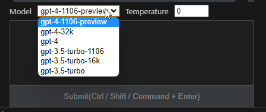

# Side Buddy

## Overview

Your friend living in the sidebar, powered by OpenAI API(from gpt-3.5-turbo to gpt-4-turbo).
You can specify the model and temperature, and refer to conversation history(shared between Windows/WSL).

## Requirements

This plugin needs Open AI API key. (sk-xxxx)

(The API key is securely stored in VSCode's Secret storage)

## Change log

See [CHANGELOG.md](./CHANGELOG.md)

## Main features

### Chat with GPT-4

You can chat with multiple models that are allowed for your API key.

---

### Remove partial message

You can remove partial messages in a thread. Since GPT-4 has a limited number of tokens (8,192 tokens in 1 thread), it is useful to build long contextual conversations.

---

### Thread history

The contents of the thread can be saved. The saved contents are shared between Windows/WSL and can be loaded at any time.

---

### Model, temperature

You can specify model, temperature.

- The model parameter is used to control response quality, speed and character.
- The temperature parameter is used to control the diversity of generated text. This parameter is specified in the range of 0 to 2, and the higher the value, the more diverse the responses generated. On the other hand, the lower the value, the more predictable the responses generated.

---

## Roadmap

- [ ] Keep thread history to Online Storage(e.g. S3)
- [ ] Stop message generaiton
- [ ] Bookmark a prompt
- [ ] Act against selected text in editor
- [ ] Copy request as curl command line
