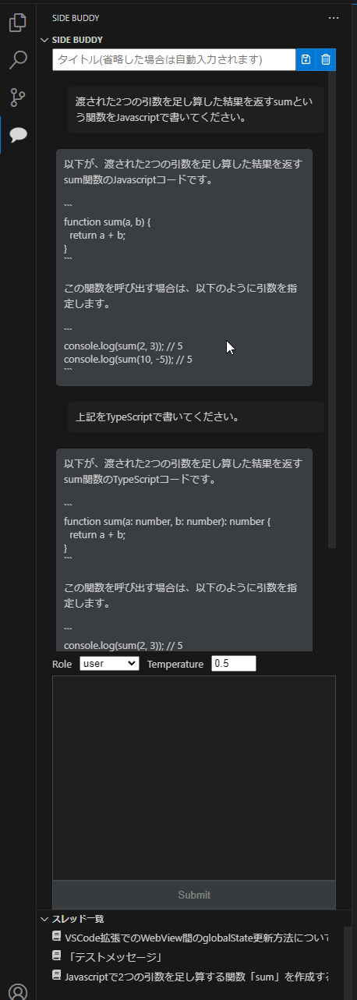

# side-buddy README

## 概要

VSCode のサイドメニューに OpenAI API を使用したチャット機能を常駐させる拡張です。
現在開発途中ですが以下の機能を用意する予定です。

- role や temperature などを指定してメッセージ送信
- 端末を跨ったチャット履歴の保存
- スレッド内のメッセージの削除
- スレッド全体、または一部をエクスポート
- プロンプトのお気に入り登録
- リクエスト内容を curl 形式でコピー

## イメージ

## ロードマップ

- [x] サイドバーを閉じても状態を保持する
- [x] スレッドの保存(履歴の保存)
- [ ] スレッド履歴を S3 などの外部ストレージに保存
  - [ ] 端末を跨って同期
- [ ] 生成停止を可能にする
- [x] API キーを再設定出来るように
- [x] スレッド内のメッセージを削除できるようにする
- [ ] リクエスト内容を curl 形式でコピー

## ビルド手順

TODO

## 設定項目
